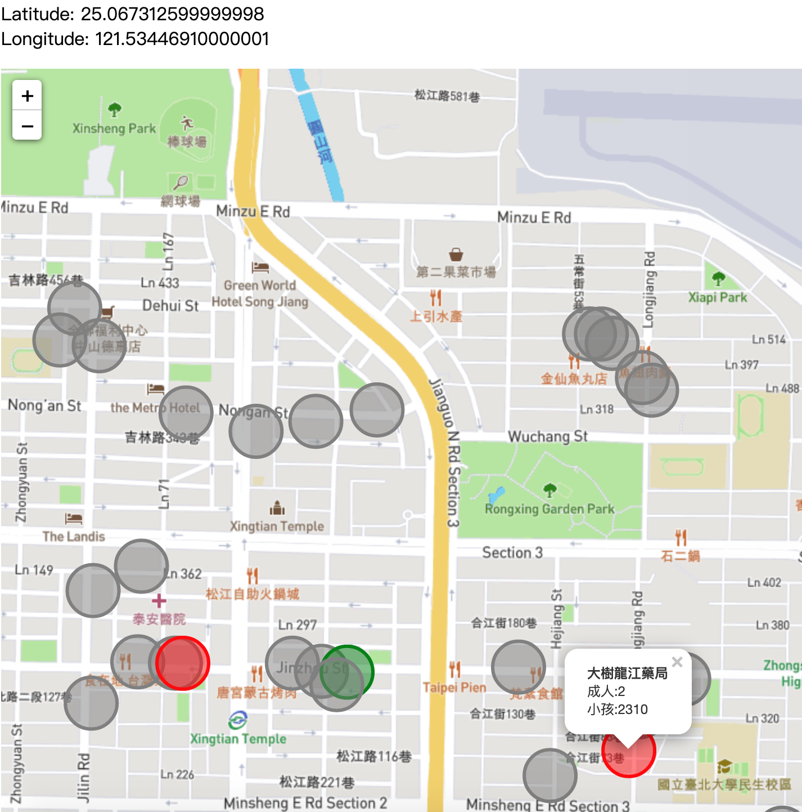

Mask Map visualization
=====

此專案靈感來自GDG Howard的[口罩地圖](https://mask.goodideas-studio.com/)，利用課堂所學去爬取政府開放資料、Pandas整理資料、MySQL儲存及利用leafletjs視覺化地圖，每日早上8.到晚上10.會進行爬取資料。檔名存成當日日期.csv。在不爬取資料時會將資料存進MySQL資料庫。
## 截圖

## How to run
1. clone此專案:```git clone https://github.com/alanhc/mask.git```
2. 取得所需套件```pip install -r requirements.txt```
3. 建立好MySQL資料庫的db_mask資料庫及mask資料表

server端
* 爬取及整理資料
  1. 到專案根目錄執行```python run.py```
* host 在server
  1. 到 dist/ 資料夾底下執行```python -m http.server 8080```
  2. 瀏覽器打開 http://localhost:8080/
